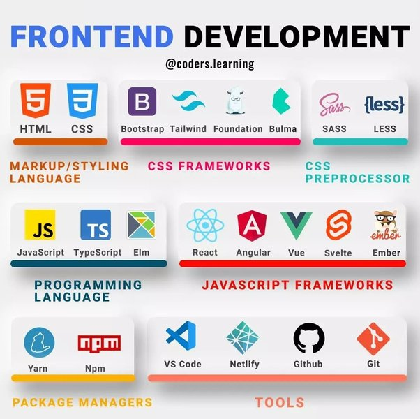

# My Plan

## Home work 
- [] english summarize (easy) (do in on 4/9/68)

## Tomorow
- [] talking my mother about piano Badger BX-16 (can play piano to hobby)
- [] upload my portfolio to porfolio group

## md project (have portfolio to use in applying for work) (before 4/9/65) (4 day)
- grad 7-9
    - [] mixer rubber
    - [] JSTP

- grade 10-12
    - [] bennett
    - [] robot student art
    - [] TJSIF
    - [] Era Odeyssey
    - [] POSN COMPUTER camp 2 && competitive programming student art

## The learning path before applying work (30-40 day in mount 9) 
- freshman (Employ all of this to vercel and use in CV)
    <!--  -->
    - NodeJS with Database (use both mongoDB and Mysql)
    - PHP with Database (use both mongoDB and Mysql)
    - Use other api with serve such as google traslate
    - throw AI on the serve
    - Type script react vue
    - Making Main server to keep all project i have

## Generaly
- **[] Rewrite all project since grade 7 to .md file** (before 4/9/65) (4 day)
    reward is kfc 1 meals

- **[] Practice and understand maths and physics before module 1 exam** (before 10/9/65) (6 day)
     reward is kfc 1 meals

- **[] learn amout freshman plan detail and do it** (30-40 day in mount 9) 
    - NodeJS with Database (use both mongoDB and Mysql) (Have show case working)
     reward is kfc 1 meals

    - PHP with Database (use both mongoDB and Mysql) (Have show case working but this is php)
     reward is kfc 1 meals

    - throw AI on the serve & Type script react vue (Have show case working that i can be front end)
     reward is kfc 1 meals

    - Making Main server to keep all project i have
     reward is kfc 1 meals

- **[] Rewrite all project since grade 7 to webpage** (none)
     reward is kfc 1 meals

